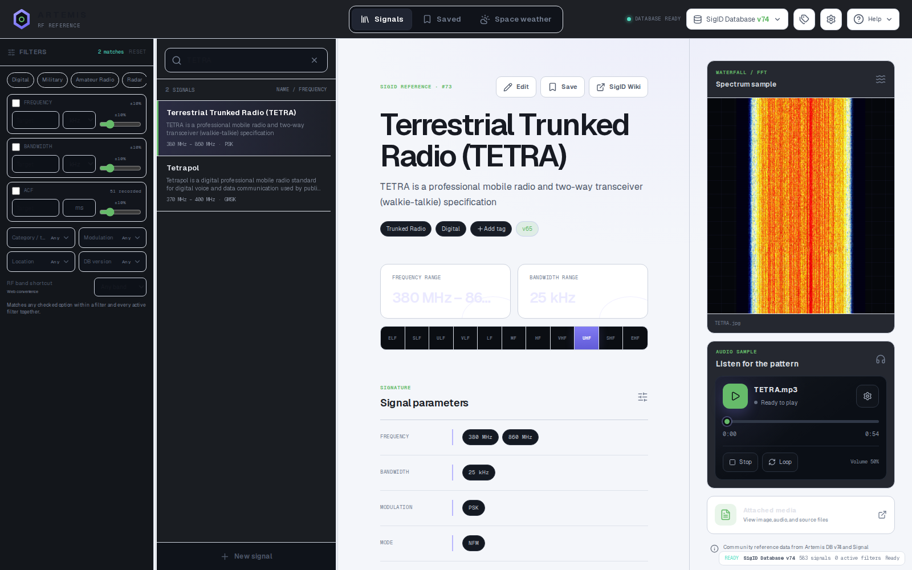

# Artemis RF Reference

A fast, responsive browser adaptation of the radio-signal identification workflow from [AresValley/Artemis](https://github.com/AresValley/Artemis). It puts the current SigID catalog, identification filters, reference media, and local field-work tools into a single web workspace.

**[Open the live application →](https://artemis.andrewmohawk.xyz)**

[](https://artemis.andrewmohawk.xyz)

> [!IMPORTANT]
> This is an independent web implementation. It is not an official Artemis release and is not affiliated with or endorsed by AresValley.

## What it includes

- The current tagged SigID catalog with descriptions, frequency, bandwidth, modulation, mode, ACF, location, database-version metadata, spectrum images, audio samples, and source links.
- Instant full-text search and always-visible filters for RF band, frequency, bandwidth, ACF, category, modulation, location, and database version.
- A visible 10% default tolerance on numeric filters so nearby signals are not hidden by overly exact matching.
- Responsive desktop and mobile layouts, resizable desktop panes, keyboard navigation, and virtualized result rendering.
- Bookmarks and a Saved view for frequently referenced signals.
- Audio playback with scrubbing, looping, volume, and supported output-device selection.
- Local database, signal, tag, document, attachment, and preference managers with validated JSON import/export.
- Live AresValley Poseidon space-weather data and upstream application/database release checks.

## Run locally

Artemis RF Reference requires Node.js 22.13 or newer.

```bash
npm ci
npm run dev
```

Open the local URL printed by the development server. To exercise the production build locally:

```bash
npm run build
npm start
```

## Test

```bash
npm test
npm run lint
```

The test suite builds the Cloudflare Worker and covers server rendering, metadata, search and filter behavior, 10% tolerance matching, workspace persistence and conflict handling, and validated database import/export.

## Deploy to Cloudflare Workers

Authenticate Wrangler, then run the reproducible deployment command:

```bash
npx wrangler login
npm run deploy:cloudflare
```

The build emits a Cloudflare Worker in `dist/server` and edge-hosted assets in `dist/client`; this is not a static Pages export. The production route is configured in `vite.config.ts`. Forks should replace `artemis.andrewmohawk.xyz/*` and its `zone_name` with a hostname in their own Cloudflare account.

The application does not require D1, R2, KV, application secrets, or an authentication service.

## Automatic database releases

The [`Update Artemis database`](.github/workflows/update-artemis-db.yml) workflow checks the official Artemis release metadata every hour. When AresValley publishes a newer Artemis-DB release, the workflow:

1. requires the official release metadata and GitHub release to agree on the version, archive URL, byte size, and SHA-256 digest;
2. downloads and verifies the release archive and its embedded SQLite database version;
3. checks out only `static/*/signal.json` from the immutable release tag, without running upstream code;
4. validates every record, unique page ID, version, media field, and a catalog-shrink safety threshold;
5. regenerates `signals.json` and its provenance manifest deterministically;
6. runs lint, the production build, and the complete test suite;
7. commits the generated files and deploys that exact revision to Cloudflare Workers.

The production repository needs a `CLOUDFLARE_ACCOUNT_ID` Actions variable and either a `CLOUDFLARE_API_TOKEN` secret or a Wrangler OAuth configuration stored as `WRANGLER_OAUTH_CONFIG`. A dedicated API token restricted to Workers Scripts and Workers Routes for the target account and zone is preferred. A manual workflow run can explicitly allow an unusually large upstream removal after review; scheduled updates always fail closed. The hourly job also reconciles a failed deployment on its next run even when the catalog commit already succeeded. A monthly heartbeat commit keeps GitHub from disabling scheduled workflows after 60 days of inactivity in a public repository.

## Local persistence and privacy

Bookmarks, preferences, custom databases, signal edits, tags, documents, and attachments stay in the browser using IndexedDB, with localStorage as a recovery fallback. There are no user accounts, server-side user records, or application analytics. Export a JSON database bundle before clearing site data or moving to another browser.

The catalog is served by this application. Live space-weather and release checks contact AresValley and GitHub, while linked spectrum and audio media may be loaded from Signal Identification Wiki or AresValley infrastructure. Those services receive normal web requests when their content is used.

## Relationship to upstream Artemis

This project exists because of the work of the original Artemis and signal-identification communities:

- [AresValley/Artemis](https://github.com/AresValley/Artemis) — the original desktop application and RF-identification workflow.
- [Official Artemis documentation](https://aresvalley.github.io/Artemis/) and [AresValley website](https://aresvalley.com).
- [AresValley/Artemis-DB](https://github.com/AresValley/Artemis-DB) — the SigID database used by Artemis.
- [Signal Identification Wiki](https://www.sigidwiki.com/wiki/Signal_Identification_Guide) — the community-maintained source material behind much of the catalog.

The interface and web architecture in this repository are independently structured, while source and community-reference links remain visible throughout the application.

## License and data notice

The application code is distributed under the [GNU General Public License v3.0 or later](LICENSE).

Artemis, Artemis-DB, the Signal Identification Wiki catalog, and linked media remain the work of their respective contributors and rightsholders. Artemis-DB does not currently include a separate repository-level license, so its catalog text and media must not be assumed to be relicensed by this project's GPL. Review the upstream terms and obtain any required permission before redistributing those materials.
